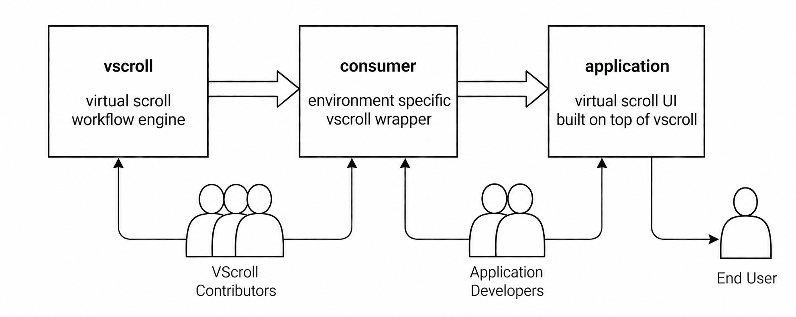

[](https://github.com/dhilt/vscroll/actions/workflows/general.yml)
[](https://www.npmjs.com/package/vscroll)

# VScroll

A framework-independent virtual scrolling engine for JavaScript and TypeScript.

- [Overview](#overview)
- [Installation](#installation)
- [Usage](#usage)
- [Adapter API](#adapter-api)
- [Documentation](#documentation)
- [Thanks](#thanks)

## Overview

Virtual scrolling is a technique for displaying large lists efficiently. Instead of rendering every item at once, it keeps a small set of items in the DOM — those in and around the visible area — and updates that set as the user scrolls. This reduces DOM size and rendering work while preserving a familiar scrolling experience.

VScroll provides a framework-independent **core engine** for virtual scrolling. An application can use it directly or through a platform-specific wrapper called a **consumer**. The diagram shows how the engine reaches the end user when a consumer is used.

<p align="center">
  
</p>

The [minimal browser demo](https://dhilt.github.io/vscroll/) demonstrates direct use of VScroll without a separate consumer.

Existing consumers and integration examples include:

- [ngx-ui-scroll](https://github.com/dhilt/ngx-ui-scroll) — an Angular virtual scrolling directive.
- [vscroll-native](https://github.com/dhilt/vscroll-native) — a virtual scrolling module for native JavaScript applications.
- [Vue integration sample](https://stackblitz.com/edit/vscroll-vue-integration?file=src%2Fcomponents%2FVScroll.vue) — an example of using VScroll in Vue.

## Installation

### CDN

Load the library in a browser and access its exports through `VScroll`:

```html
<script src="https://cdn.jsdelivr.net/npm/vscroll"></script>
<script>
  new VScroll.Workflow(...);
</script>
```

For reproducible deployments, pin the CDN URL to a package version.

### NPM

```sh
npm install vscroll
```

Import the library in the application's build:

```js
import * as VScroll from 'vscroll';

new VScroll.Workflow(...);
```

## Usage

A `vscroll` consumer is responsible for the integration: supplying data when requested by the engine and rendering the current buffer in the DOM. The engine manages scrolling, determines which items are needed, and updates the buffer; the consumer defines how data is retrieved and displayed. This integration is configured when creating `Workflow`, the main entry point to the engine.

### Workflow

The Workflow class, exported by vscroll, is where the integration is configured. Instantiating it starts the engine. See the [Workflow reference](docs/workflow.md) for the requirements behind its constructor parameters.

```js
const workflow = new VScroll.Workflow({ consumer, element, datasource, run, Routines });
```

| Parameter | Purpose |
| --- | --- |
| `consumer` | Static integration metadata (`name` and `version`), used in diagnostics. |
| `element` | The mounted DOM element containing the rendered list, not the scrollable viewport. |
| `datasource` | The object that supplies data and scrolling settings, described below. See also [Datasource](docs/datasource.md). |
| `run(items)` | The callback that keeps the rendered list in sync with the complete current buffer, including offscreen items. See [Rendering](docs/rendering.md). |
| `Routines` | Optional subclass of `VScroll.Routines` for customizing DOM operations and render scheduling. See [Custom Routines](docs/routines.md). |

### Datasource

Every `Workflow` requires a datasource object to supply items on request and, optionally, configure scrolling. Its data and configuration fields are `{ get, settings, devSettings }`. See the [Datasource reference](docs/datasource.md) for the full contract, supported signatures, and implementation examples.

- **`get`** is the required data retrieval function, called with a starting index and item count. It can be synchronous or asynchronous. A minimal callback example providing a synchronous, infinite data stream:

  ```js
  const get = (index, count, callback) =>
    callback(Array.from({ length: count }, (_, i) => `Item ${index + i}`));
  ```

- **`settings`** is an optional object for configuring scrolling. The table below summarizes its options and defaults. See [Configuration](docs/configuration.md#settings) for types, constraints and examples.

  | Setting | Default | Purpose |
  | --- | --- | --- |
  | [`startIndex`](docs/configuration.md#bounds-and-initial-positioning) | `1` | Initial item index, clamped to the configured bounds. |
  | [`minIndex`](docs/configuration.md#bounds-and-initial-positioning) | `-Infinity` | Inclusive lower dataset index bound. |
  | [`maxIndex`](docs/configuration.md#bounds-and-initial-positioning) | `Infinity` | Inclusive upper dataset index bound. |
  | [`padding`](docs/configuration.md#settings) | `0.5` | Extra buffered area on each side, in viewport sizes. |
  | [`bufferSize`](docs/configuration.md#settings) | `5` | Minimum fetch batch target, not a limit on buffered items. |
  | [`itemSize`](docs/configuration.md#size-estimates-and-layout) | `NaN` | Initial item-size estimate in pixels; measured automatically when omitted. |
  | [`sizeStrategy`](docs/configuration.md#size-estimates-and-layout) | `'average'` | Estimate unknown item sizes using `'average'`, `'frequent'` or `'constant'`. |
  | [`viewportElement`](docs/configuration.md#viewport-and-horizontal-scrolling) | `null` | Custom viewport element or element factory; defaults to the content element's parent. Experimental. |
  | [`windowViewport`](docs/configuration.md#viewport-and-horizontal-scrolling) | `false` | Use the browser window as the viewport. |
  | [`horizontal`](docs/configuration.md#viewport-and-horizontal-scrolling) | `false` | Scroll horizontally instead of vertically. |
  | [`inverse`](docs/configuration.md#other-settings) | `false` | Align short content to the bottom or right without reversing item order. Experimental. |
  | [`infinite`](docs/configuration.md#settings) | `false` | Keep loaded items instead of clipping them automatically. |
  | [`onBeforeClip`](docs/configuration.md#settings) | `null` | Receive clipped items just before they leave the buffer. Experimental. |

- **`devSettings`** is an optional object for logging, timing, caching and scroll behavior. See [Development settings](docs/configuration.md#development-settings) for its options and defaults.

## Adapter API

The Adapter API extends the scrolling engine with reactive state observation and runtime control. It provides access to loading state, visible items and dataset boundaries, supports adding, removing and updating items or reloading data, and enables synchronization of application actions with scroller activity. These capabilities support interactive interfaces such as chats, live feeds and editable lists, where content evolves in response to incoming data and user actions.

The Adapter API is available when a datasource is created through the `makeDatasource` factory exported by `vscroll`.

```js
const Datasource = VScroll.makeDatasource();
const datasource = new Datasource({ get, settings });
const adapter = datasource.adapter;

// Reload data when the refresh button is clicked.
refreshButton.addEventListener('click', () => adapter.reload());

// Log loading state changes.
adapter.isLoading$.on(isLoading => console.log('Loading:', isLoading));
```

The Adapter is created when the datasource is instantiated. Its reactive properties can be observed before constructing `Workflow`, but method calls have no effect until `Workflow` finishes initializing. See [Calling Adapter methods](docs/adapter-methods.md#calling-methods).

`makeDatasource` also accepts an optional configuration factory for customizing the Adapter's reactive properties. See [Custom Adapter reactivity](docs/datasource.md#consumer-specific-adapter-reactivity).

The tables below provide a brief overview of the Adapter's properties and methods. See [Adapter properties](docs/adapter.md) and [Adapter methods](docs/adapter-methods.md) for details, and the [ngx-ui-scroll Adapter demos](https://dhilt.github.io/ngx-ui-scroll/#adapter) for interactive examples.

### Properties

Properties are read-only. Each `$` counterpart provides [reactive updates](docs/adapter.md#reactive-subscriptions).

| Property | Purpose |
| --- | --- |
| `init`, `init$` | Whether the Adapter is initialized. |
| `isLoading`, `isLoading$` | Whether a workflow cycle is running, including fetching and rendering. |
| `loopPending`, `loopPending$` | Whether an inner workflow loop is running. |
| `paused`, `paused$` | Whether workflow processing is paused. |
| `bufferInfo` | Buffer, cache and dataset index bounds, plus the estimated item size. |
| `itemsCount` | Number of rendered buffer items, including offscreen items. |
| `firstVisible`, `firstVisible$` | First item intersecting the viewport, including a partially visible item. |
| `lastVisible`, `lastVisible$` | Last item intersecting the viewport, including a partially visible item. |
| `bof`, `bof$` | Whether the buffer has reached the dataset's beginning. |
| `eof`, `eof$` | Whether the buffer has reached the dataset's end. |
| `packageInfo` | Core and consumer package names and versions. |

### Methods

| Method | Purpose |
| --- | --- |
| `relax` | Wait until the scroller is idle. |
| `reload` | Reload data at an optional starting index, keeping the current configuration. |
| `reset` | Restart the scroller with optional datasource and settings changes. |
| `pause`, `resume` | Suspend or resume workflow processing. |
| `append`, `prepend` | Add items after or before the known range. |
| `insert` | Insert items before or after a target item. |
| `remove` | Remove selected items by predicate or indexes. |
| `replace` | Replace matching buffered items with a new set of items. |
| `update` | Keep, remove or replace buffered items using a callback. |
| `check` | Re-measure rendered items after their sizes change. |
| `clip` | Trim offscreen buffer items beyond the configured padding. |
| `fix` | Directly adjust scroll position, index bounds or items. Experimental. |
| `showLog` | Print collected debug logs. |

## Documentation

The reference pages below are being developed separately from this README. See the [documentation index](docs/index.md) for a guided path through them.

- **Core integration**
  - [Virtual scrolling model](docs/virtual-scrolling.md) — understand how the viewport, item buffer and DOM rows fit together.
  - [Workflow and lifecycle](docs/workflow.md) — construct, dispose and recreate an integration.
  - [Datasource](docs/datasource.md) — provide data, handle failures and manage request ownership.
  - [Rendering](docs/rendering.md) — implement the consumer's DOM and rendering contract.

- **Configuration and extensions**
  - [Configuration](docs/configuration.md) — configure sizing, buffering, scrolling and diagnostics.
  - [Adapter properties](docs/adapter.md) — inspect workflow state and visible items.
  - [Adapter methods](docs/adapter-methods.md) — control the scroller and modify buffered items.
  - [Custom Routines](docs/routines.md) — customize DOM operations and scheduling.

- **Help**
  - [Troubleshooting](docs/troubleshooting.md) — diagnose integration problems and use debug logs.

## Thanks

- To [Mike Feingold](https://github.com/mfeingold), who started this project family in 2013.
- To [Joshua Toenyes](https://github.com/JoshuaToenyes), who transferred ownership of the vscroll npm package name.
- To all contributors to [ui-scroll](https://github.com/angular-ui/ui-scroll/graphs/contributors) and [ngx-ui-scroll](https://github.com/dhilt/ngx-ui-scroll/graphs/contributors).
- To everyone supporting the project through donations.

---

2026 &copy; [Denis Hilt](https://github.com/dhilt) · [MIT license](LICENSE)
