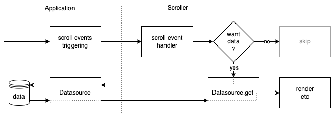

# Datasource

[← Documentation index](index.md) · Working draft

A datasource is the application-provided object from which vscroll obtains data. During initialization and as scrolling reveals missing items, the Scroller calls its `get` function. The application supplies values; vscroll adds them to its item buffer and passes that buffer to the consumer's `run(items)` for [rendering](rendering.md). The datasource itself does not render DOM.



## Data ranges and boundaries

Every [Workflow](workflow.md) needs a datasource object with `get`. It may also have `settings` and `devSettings`, documented in [Configuration](configuration.md). A plain object is enough for ordinary scrolling. This minimal callback example supplies synchronous, infinite data:

```js
const datasource = {
  get: (index, count, success) =>
    success(Array.from({ length: count }, (_, offset) => ({
      text: `Item ${index + offset}`
    })))
};
```

`get(index, count)` requests the consecutive indexes from `index` through `index + count - 1`, inclusive. Indexes may be zero or negative. Requests can move in either direction, vary in size, and repeat earlier ranges. The response must contain no more than `count` values, ordered by increasing index with no gaps. These are application values, not VScroll items: vscroll assigns their `$index` from their positions in the response, not from an application `id` field.

A finite datasource can read from an application collection. In this example, datasource indexes start at `1` and map to the array's zero-based offsets:

```js
const MIN_INDEX = 1;
const records = [
  { id: 'a', text: 'Alpha' },
  { id: 'b', text: 'Beta' },
  { id: 'c', text: 'Gamma' }
];

const datasource = {
  get(index, count, success) {
    const start = index - MIN_INDEX;
    success(records.slice(start, start + count));
  },
  settings: {
    startIndex: MIN_INDEX,
    minIndex: MIN_INDEX,
    maxIndex: MIN_INDEX + records.length - 1
  }
};
```

A short response signals a dataset boundary, not a partially loaded page. For a forward request it establishes the upper boundary; for a backward request, the available values are placed immediately before the existing buffer and establish the lower boundary. For example, on a backward request after the buffer exists, if the requested range is `-2..2` but the dataset begins at `1`, the response contains the values for `1..2`, in that order. An empty response means no data in that direction; an empty initial response marks both boundaries for the current dataset.

The first request is special: if its response is short, vscroll indexes those values starting at the effective `startIndex`. For a nonempty dataset, `startIndex` must refer to an existing item. Known inclusive `minIndex` and `maxIndex` bounds can be set in [settings](configuration.md#settings); otherwise short responses reveal the edges. `bufferSize` is only a request-size target, not a fixed `count` or a limit on rendered rows.

## Asynchronous delivery and errors

When data comes from an asynchronous service, `get` can return its Promise directly. Here `dataService.readAsync(index, count)` is supplied by the application and resolves to an ordered array that follows the same range contract:

```js
const datasource = {
  get: (index, count) => dataService.readAsync(index, count)
};
```

`get` should use one delivery style. Returning an array directly or combining a callback with a returned Promise or Observable is unsupported. Each request must settle once:

| Style | How to deliver data or failure |
| --- | --- |
| Callback | Data or errors are delivered through `success(data)` or `fail(error)`, synchronously or later. Core supplies `fail`, although its TypeScript parameter is optional. |
| Promise-like | `get` returns a Promise resolving to `data` or rejecting with an error; an `async get(index, count)` works. |
| Observable-like | `get` returns an object with `subscribe(next, error, complete)`; one array is emitted through `next` or an error through `error`. |

An Observable-like source is a one-request delivery mechanism, not a live stream of list changes. Completing without an array or error leaves the request pending. Its subscription must provide `unsubscribe()`, but core does not unsubscribe on cancellation or error; the source owns that cleanup. The current TypeScript Observable declaration has an extra array nesting; the runtime expects `Data[]`, not `Data[][]`. A callback or Promise adapter avoids this type mismatch.

Failures are reported through `fail`, Promise rejection or Observable error. A synchronous exception thrown by `get` is not converted into a fetch failure. An error must not be represented by `[]`: that tells the Scroller it has reached a boundary. vscroll does not retry automatically; the application handles errors and decides whether to retry.

`get` must declare both `index` and `count` as parameters: runtime validation requires `get.length >= 2`. A custom class method needs binding or an arrow property because vscroll calls it without binding `this`.

## Caching datasource requests

As the viewport moves, the Scroller may request ranges that overlap earlier requests. Its internal cache stores measured sizes and, optionally, item data, but does not serve `get` responses. For an unbounded dataset whose service returns every requested item, a datasource can cache items by index and fetch only missing spans:

```js
const cache = new Map();
const datasource = {
  get: async (index, count) => {
    const result = [];
    const end = index + count;
    let current = index;
    while (current < end) {
      if (cache.has(current)) {
        result.push(cache.get(current));
        current++;
        continue;
      }
      let next = current + 1;
      while (next < end && !cache.has(next)) next++;
      const missing = await dataService.readAsync(current, next - current);
      missing.forEach((item, offset) => cache.set(current + offset, item));
      result.push(...missing);
      current = next;
    }
    return result;
  }
};
```

For a bounded dataset, a short response must be cached under the items' actual indexes, taking known boundaries into account. The cache must be invalidated when data or index assignments change, and its size should be limited for long-running lists.

## Creating a datasource with an Adapter

A datasource can also expose the [Adapter API](adapter.md), which lets an application observe and control a running scroller—for example, track loading state, reload data, or update items. For the API to be available as `datasource.adapter`, the datasource must be an instance of the class returned by `makeDatasource()`:

```js
import { makeDatasource } from 'vscroll';

const Datasource = makeDatasource();
const datasource = new Datasource({
  get: (index, count) => dataService.readAsync(index, count)
});
const adapter = datasource.adapter;
```

The resulting datasource serves as the `datasource` argument to `Workflow`. Reactive Adapter properties can be observed immediately; methods that control the scroller take effect only after [Workflow initialization](adapter.md#results-lifecycle-and-sequencing).

For TypeScript, `IDatasource<T>` describes the general shape and `IDatasourceConstructed<T>` guarantees the Adapter property. Both interfaces are exported from `vscroll`.

## Consumer-specific Adapter reactivity

`makeDatasource(getAdapterConfig?)` can replace individual Adapter reactive properties for a framework integration. The optional factory runs once per datasource instance and returns `IAdapterConfig`: `{ mock: boolean, reactive?: ... }`. Each reactive entry, keyed by an `AdapterPropName`, supplies `{ source, emit(source, value) }`. The Adapter exposes `source` as that property and calls `emit` when its value changes. Unconfigured properties keep native reactivity; a supplied configuration does not merge in the default factory configuration.

```ts
import { AdapterPropName, makeDatasource } from 'vscroll';

const Datasource = makeDatasource(() => ({
  mock: false,
  reactive: {
    [AdapterPropName.isLoading$]: {
      source: new EventTarget(),
      emit(source, value) {
        (source as EventTarget).dispatchEvent(new CustomEvent('change', { detail: value }));
      }
    }
  }
}));
const reactiveDatasource = new Datasource({ get });
```

Here `reactiveDatasource.adapter.isLoading$` is an `EventTarget` at runtime, not the default reactive object; subscriptions use `addEventListener`, not `.on()`. In TypeScript, this property needs a narrower or consumer-specific Adapter type, since the default type still describes native reactivity. Each instance needs a fresh `source`, and consumer-owned listeners must be released when its view is destroyed. The [ngx-ui-scroll datasource bridge](https://github.com/dhilt/ngx-ui-scroll/blob/master/scroller/src/ui-scroll.datasource.ts) demonstrates custom Adapter reactivity in a framework integration.
