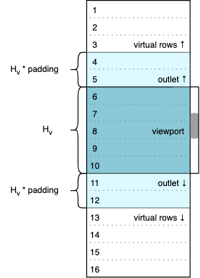
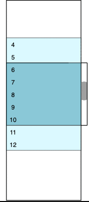

# Virtual scrolling model

[← Documentation index](index.md)

To the end user, VScroll presents one continuous scrollable list. It maintains an ordered buffer of items; the **consumer**—an application or framework integration—renders a DOM row for each. Dataset positions outside the buffer remain virtual, represented by empty space.

 

The dark-blue region shows rows visible through the **viewport**, whose height $H_v$ is set by page layout. The light-blue **outlets** are rendered rows just outside it. Together, these rows represent the buffer in the DOM. `settings.padding` targets each outlet's size as a fraction of $H_v$ (default `0.5`); an outlet may be shorter near a dataset boundary.

The white regions represent virtual rows. Empty **padding elements** before and after the buffer reserve their estimated space. Unlike outlets, these elements contain no rendered rows. See [Rendering](rendering.md) for the DOM structure.

The items in this buffer originate with the [datasource](datasource.md) supplied to `Workflow`: it returns application values for requested index ranges. VScroll wraps each value in an item: `item.data` holds the value, while `item.$index` is its current dataset position—the number shown in the diagrams.

The consumer supplies `run(items)` when constructing `Workflow`. During initialization and after buffer changes, VScroll calls it with the complete current item buffer, not just newly fetched items. The consumer uses this list to keep the corresponding DOM rows in sync. See [Rendering](rendering.md#the-runitems-callback) for the implementation contract.

As the user scrolls, VScroll requests data for approaching positions, adds the resulting items to the buffer, clips distant items, and adjusts the padding elements. It measures rendered rows to refine its estimates of virtual space and may correct the scroll position to keep content in place. Setting [`settings.infinite = true`](configuration.md#settings) switches the scroller from virtual scrolling to infinite scrolling: automatic clipping stops and loaded rows accumulate. The dataset itself may still be finite.
